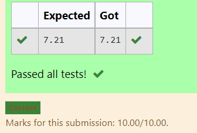

# DISTANCE-BETWEEN-TWO-POINTS

## AIM:
To write a python program to find the distance two 2 points
## ALGORITHM:
## Step 1: 
### Import a math function for calculation
## Step 2: 
### Get the values of first and second coordinators 
## Step 3: 
#### Substitute the values in the distance formula using square root function   
## Step 4: 
### Print the value got for the distance between two points using format function
## Step 5:
### End the Program 
### PROGRAM:
```
#Program to find the distance between two points.
#Developed by:Harini.B
#RegisterNumber:21000879
import math
x=[10,4]
y=[6,2]
value=math.sqrt(((x[0]-x[1])**2+(y[0]-y[1])**2))
print("{:.2f}".format(value))
```
### OUTPUT:

### RESULT:
The python program to find the distance two 2 points is successfully executed.